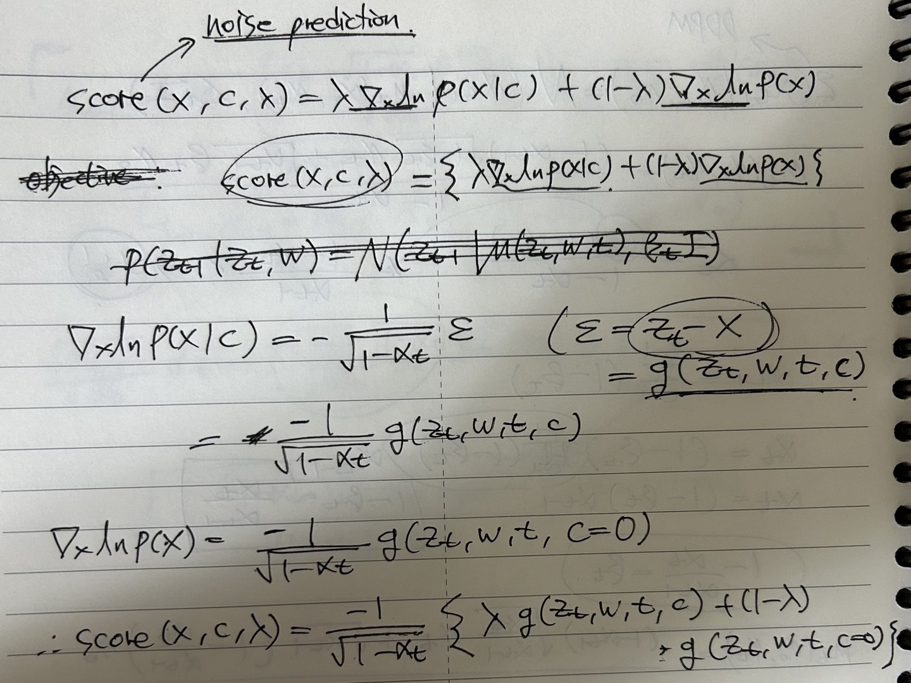
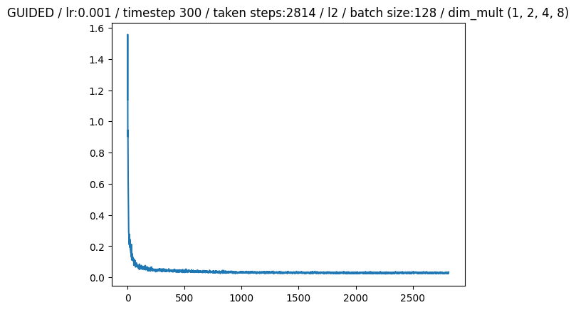
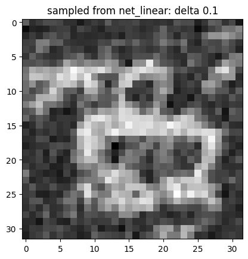
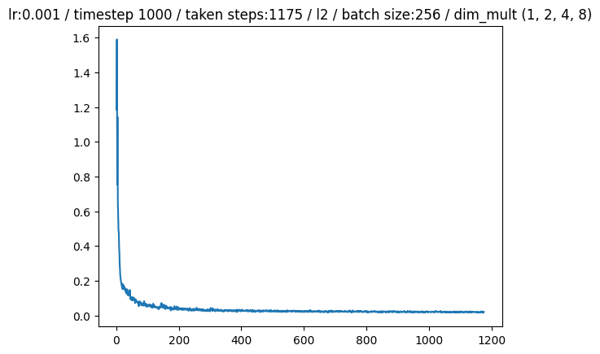
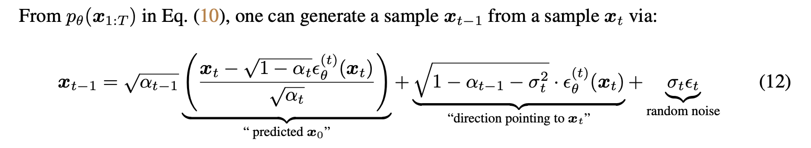
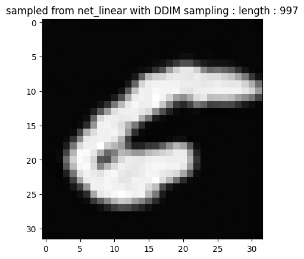
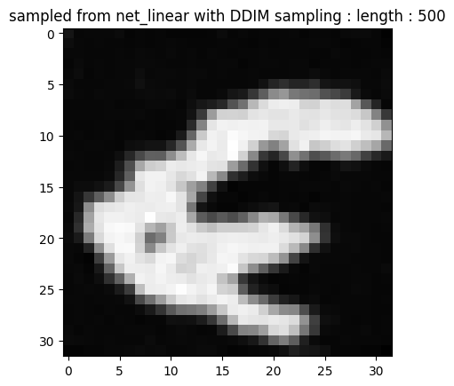
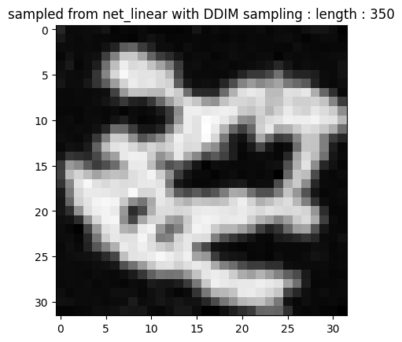
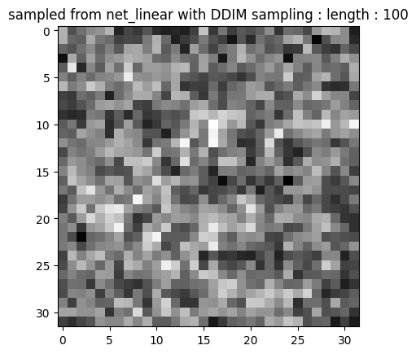

# Diffusion Model Learning: 2024 U-SURF program 

Learning Diffusion Model(DDPM) and basics of PyTorch to code DDPM

## Table

- [Diffusion Model Learning: 2024 U-SURF program](#diffusion-model-learning-2024-u-surf-program)
  - [Table](#table)
  - [Environment Required](#environment-required)
  - [pytorch learning jupyter notebooks based on 차근차근 실습하며 배우는 파이토치 딥러닝 프로그래밍](#pytorch-learning-jupyter-notebooks-based-on-차근차근-실습하며-배우는-파이토치-딥러닝-프로그래밍)
  - [Diffusion model coding](#diffusion-model-coding)
    - [Forward Process](#forward-process)
    - [Learning U-net \& diffusion model with pytorch](#learning-u-net--diffusion-model-with-pytorch)
    - [Diffusion Model coding](#diffusion-model-coding-1)
    - [Guided Diffusion model coding](#guided-diffusion-model-coding)
      - [Codes](#codes)
      - [Model Overview](#model-overview)
      - [Results](#results)
    - [DDIM coding](#ddim-coding)
      - [Codes](#codes-1)
      - [Model Overview](#model-overview-1)
      - [Results](#results-1)
  - [Paper reviews](#paper-reviews)

## Environment Required

- python 3.8
- PyTorch 2.3.1
- cuda 11.8

I will make complete `main.py` to execute model (Diffusion Model / Guided Diffusion / DDIM) learning and sampling.

## pytorch learning jupyter notebooks based on [차근차근 실습하며 배우는 파이토치 딥러닝 프로그래밍](https://github.com/wikibook/pytorchdl2)
  - [pytorch_learning_mnist.ipynb](/pytorch_learning_mnist.ipynb) : download & use MNIST dataset in pytorch
  - [pytorch_learning_CNN.ipynb](/pytorch_learning_CNN.ipynb) : how to use CNN in pytorch

## Diffusion model coding
  
### Forward Process
- [forward_process.ipynb](/forward_process.ipynb) : forward process - using MNIST
  
### Learning U-net & diffusion model with pytorch 

- [https://huggingface.co/blog/annotated-diffusion](https://huggingface.co/blog/annotated-diffusion) : referenced website
- [Unet_learning.ipynb](./Unet_learning.ipynb) : U-net & Diffusion model Learning
- [Unet.py](./Unet.py) : U-net as complete module
  
### Diffusion Model coding

- [diffusion_model.ipynb](/diffusion_model.ipynb) : Diffusion model training & sampling using MNIST dataset
- [DiffusionModel.py](./DiffusionModel.py) : Diffusion model as complete module - containing Guided sampling, DDIM sampling
- [diffusion_model_abstract.ipynb](./diffusion_model_abstract.ipynb) : Compressed version of `diffusion_model.ipynb` using `DiffusionModel.py`
  
### Guided Diffusion model coding

#### Codes
- [guided_diffusion_training.ipynb](./guided_diffusion_training.ipynb) : Guided Diffusion model training
- [GuidedUnet.py](./GuidedUnet.py) : GuidedUnet - modified Unet to accept integer conditioning variable
- [guided_diffusion_sampling.ipynb](./guided_diffusion_sampling.ipynb) : Guided Diffusion model sampling

#### Model Overview

- hyperparameters
  - timestep: 300
  - learning rate : 1e-3
  - condition shift (used in embedding conditioning variable) : timestep + 100
  - epoch : 5

- IDEA: 

- training
  - First 5 epochs : train denoising `GuidedUnet` with MNIST data label(act as conditioning variable)
  - last 1 epoch : train denoising `GuidedUnet` without MNIST data label
  - training loss :   

- sampling
  - use *langevin dynamics* as sampling method
  - $x_{t-1}=x_t+{\beta_t \over 2}score(x,c,\lambda)+\sqrt{\beta_t}\epsilon_t$
  - $\epsilon_t=\mathcal{N}(\epsilon_t|\mathbf{0}, \mathbf{I})$

#### Results

Sample image from `GuidedUnet` with `delta`=0.1, `condition`=5, sampled image does not look like *number 5* in MNIST dataset.

Problem might be inside add conditioning variable embedding in `GuidedUnet`.

### DDIM coding

#### Codes
- [DDIM_training.ipynb](./DDIM_training.ipynb) : train model for DDIM sampling
- [DDIM_sampling.ipynb](./DDIM_sampling.ipynb) : DDIM sampling from DDPM model

#### Model Overview

- hyperparameters
  - timestep: 1000
  - learning rate : 1e-3
  - epoch : 5

- training
  - train `Unet` same as Diffusion model except timestep is 1000.
  - training loss :   

- sampling
  - use DDIM sampling method:   where $\sigma_t=0$ for all $t$
  - use exponential scheduling for making subsequence $\tau$ from $[1,...,T]$. `length` hyperparameter indicates length of $\tau$

#### Results

Using same `init_noise` as base, original Diffusion Model sampling cost about 32 s, while using `length=350`, DDIM sampling costs about 10 s.

Here are results of DDIM sampling altering `length`.

We can find that DDIM sampling has similar features of image regardless of `length` if sample images from same `init_noise`.

If `length` is too low, DDIM sample cannot sample image correctly and outputs noisy image.

## Paper reviews
  - [Diffusion Model - Presentation](./diffusion_presentation.pdf) / [textbook](https://www.bishopbook.com/)
  - [DDIM paper - Presentation](./DDIM_presentation.pdf) / [paper](https://arxiv.org/abs/2010.02502)
  - [SnapFusion paper - Presentation](./snapfusion_presentation.pdf) / [paper](https://proceedings.neurips.cc/paper_files/paper/2023/hash/41bcc9d3bddd9c90e1f44b29e26d97ff-Abstract-Conference.html)